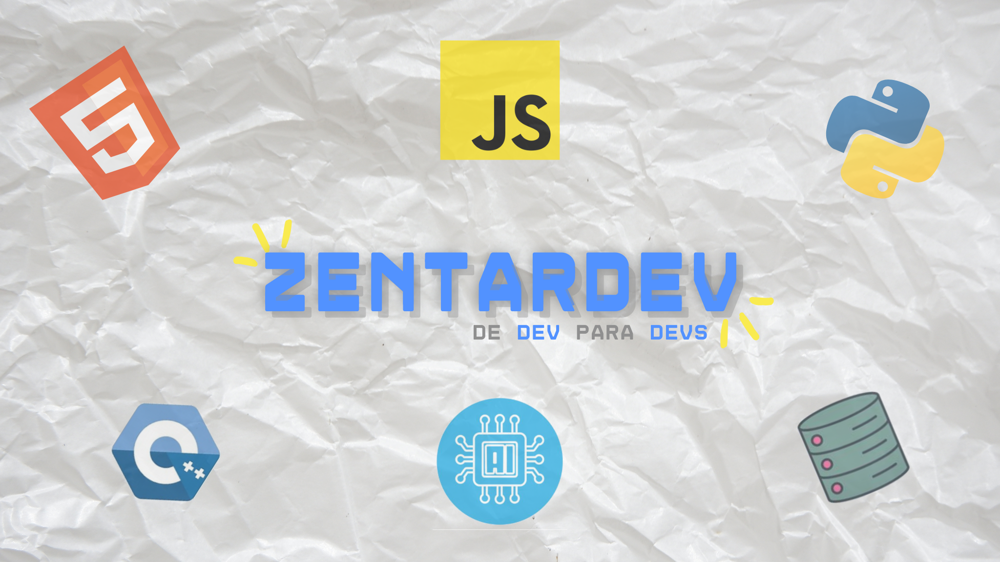

# 👋 ¡Hola! Soy ZentarDev

🎥 Creador de contenido sobre programación, tecnología, proyectos makers y mucho más.  
💡 Me gusta compartir lo que aprendo y ayudar a otros a crecer en el mundo tech.

---

## 🚀 Lo que hago

- 🔧 Desarrollo de software, automatización y proyectos IoT.
- 🎓 Enseño programación de forma simple y directa.
- 🎬 Subo contenido tech a YouTube, TikTok, Instagram y X.

---

## 🛠️ Tecnologías favoritas

---

## 🌐 Encontrame en redes

- [📺 YouTube - ZentarDev](https://www.youtube.com/@zentardev)
- [📱 TikTok - @zentardev](https://www.tiktok.com/@zentardev)
- [📸 Instagram - @zentardev](https://www.instagram.com/zentardev)
- [🐦 X (Twitter) - @zentardev](https://x.com/zentardev)

---

## 📊 Stats

---

## ✨ ¡Gracias por pasar!

Si te gusta lo que hago, ¡seguime en redes o dejá una ⭐ en algún repo!
