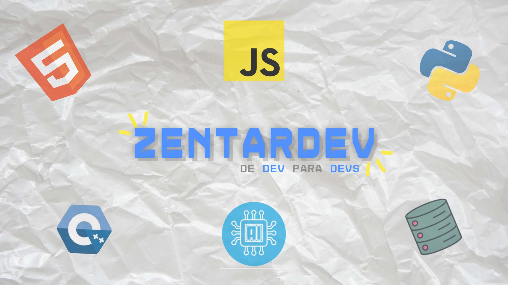

# 👋 Hi! I'm ZentarDev

🎥 Content creator about **programming, AI, and data science**.
💡 I build projects with Python, explore machine learning, and share what I learn along the way.

---

## 🚀 What I Do

* 🧠 Work with **AI & Machine Learning** (TensorFlow, Keras).
* 📊 Data analysis and visualization (NumPy, Pandas, Matplotlib).
* 🔧 Build projects with Python, automation, and IoT.
* 🎬 Share tech content and my progress on YouTube.

---

## 🌱 What I'm Learning

* 🤖 Deep Learning and neural networks.
* 📈 Advanced data analysis & real-world datasets.
* ⚙️ Building useful AI-powered tools and apps.

---

## 🛠️ Favorite Technologies

---

## 🌐 Find Me on Social Media

- [📺 YouTube](https://www.youtube.com/@zentardev)
- [🌟 LeetCode](https://leetcode.com/u/zentardev/)
---

## 📊 Stats

